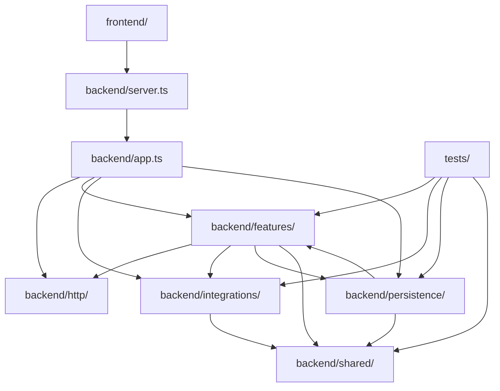
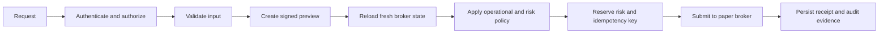
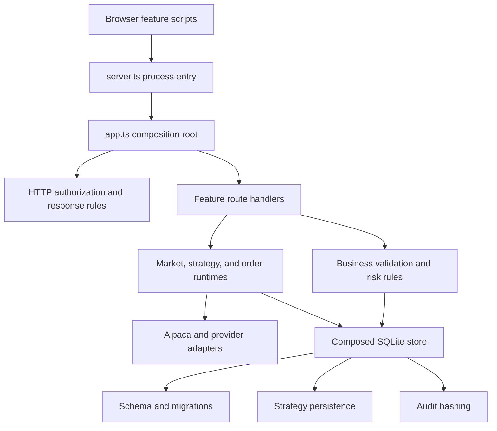

# Architecture

AI Broker is a Bun application with a browser frontend, a paper-trading backend, and SQLite persistence. Live trading is intentionally unavailable.

## Project boundaries

```text
frontend/                 Browser HTML, CSS, and JavaScript
backend/server.ts         Process entry and HTTP server startup
backend/app.ts            Dependency-injected application composition
backend/http/             Shared request, response, and authorization rules
backend/features/         Business rules grouped by product capability
backend/integrations/     Alpaca and external data-provider adapters
backend/persistence/      SQLite schema and storage operations
backend/shared/           Code used by multiple backend boundaries
tests/                    Tests grouped to mirror backend boundaries
scripts/                  Diagnostics, smoke checks, and evaluations
docs/                     Product and operating documentation
```

## Dependency direction



`server.ts` owns process startup; `app.ts` owns application wiring. `backend/http/` owns transport-wide policy. Feature route modules translate HTTP requests into feature calls; the remaining feature modules own calculations, validation, and policy. Integrations translate external provider data. Persistence owns durable state and imports feature types only where the stored contract requires them.

## Chosen system model

AI Broker is a **modular monolith with ports-and-adapters boundaries**. This is the right fit for a personal broker: one deployable process keeps order validation, risk reservation, persistence, and audit writes close enough to reason about atomically, while feature and integration boundaries prevent the codebase from becoming another flat monolith.

Microservices would add network failure modes and distributed transactions without helping a single-account workload. Split deployment units only when independently measured scaling, isolation, or availability requirements justify them.

The execution path must preserve this order:



No route extraction may reorder or bypass that pipeline.

## Change rules

- Put code in the feature that owns the behavior. Move it to `shared/` only after a second independent consumer exists.
- Keep provider-specific payload handling in `integrations/`; expose normalized values to features.
- Comment safety constraints, provider quirks, and non-obvious decisions. Do not comment syntax that already explains itself.
- Keep tests in the matching `tests/` boundary and run `bun run check` before merging.
- Preserve paper-only execution, signed previews, fresh-state validation, and operational policy checks when moving order code.

## Current state

`backend/server.ts` creates production dependencies and owns process startup. The side-effect-free `backend/app.ts` composes routes and runtimes. Operations, research/advisor, portfolio, market, strategy, and order behavior live in their feature folders.



The market boundary keeps provider retrieval and presentation separate:

- `markets/service.ts` owns provider calls, cache lifetimes, and response-time
  capture for market routes.
- `markets/market-workspace.ts` owns pure watchlist, discovery, calendar, and
  workspace normalization. Watchlist detail retrieval completes before its
  retrieval timestamp is captured; the workspace root aggregates child times
  without relabeling retrieval as observation.
- `markets/search.ts` owns deterministic asset ranking and asset-search DTO
  normalization. The service cache retains the asset-master retrieval time,
  while each search response gets a fresh response timestamp.
- `markets/company-market.ts` owns company-market normalization, including
  source-specific time provenance for asset metadata, quotes, sessions, derived
  statistics, benchmark windows, bars, and news.

The order boundary is deliberately split by responsibility:

- `orders/runtime.ts` owns broker recovery, stream reconciliation, pending-order valuation, and broker submission helpers.
- `orders/routes.ts` composes order handlers and owns order management, receipts, and decision-audit HTTP translation.
- `orders/equity-routes.ts` owns signed equity previews and fresh-state submissions.
- `orders/basket-routes.ts` owns basket previews, reservations, and independent leg submissions.
- `orders/options-routes.ts` owns option discovery, position actions, and option order workflows.

These modules share one runtime and preserve the safety pipeline above.

`portfolio/account-state.ts` owns the allow-listed account/position composite
returned to the browser. It applies the shared time taxonomy to account,
position, and managed-order state without treating request receipt time as a
provider observation. The order runtime retains per-order REST/stream receipt
times so route normalization can preserve the provenance of the state that
actually won reconciliation.

`portfolio/ledger.ts` normalizes account activities for FIFO calculations, and
`portfolio/activity-response.ts` owns their browser contract. Trade execution,
provider record creation, non-trade occurrence-or-settlement days, completed
broker retrieval, cache reuse, and response delivery remain separate. Migration
0015 stores the normalized provider and retrieval fields; older rows keep null
provenance until a later broker read supplies it. The response quality contract
also treats bounded-history truncation, missing stored time taxonomy, unmatched
sell basis, and unresolved corporate actions as consequential coverage gaps
before the shared portfolio evidence panel renders FIFO conclusions.

`portfolio/analytics.ts` owns deterministic portfolio-performance calculations
and response normalization. `portfolio/routes.ts` captures portfolio-history/
position retrieval before the optional benchmark read, then captures benchmark
retrieval and server response independently. A benchmark skipped because no
portfolio points exist remains explicitly unqueried rather than inheriting the
portfolio retrieval timestamp.

`portfolio/portfolio-optimizer.ts` owns deterministic allocation math, while
`portfolio/optimizer-response.ts` owns provider-bar normalization and the
browser contract. Current account retrieval, IEX observation windows, market
retrieval, freshness, rejected/duplicate/conflicting bars, eligibility gaps,
calculation impact, and response delivery remain separate; stale or future data
cannot enter optimizer weights.

`portfolio/risk-response.ts` owns deterministic portfolio-risk response
composition. `portfolio/routes.ts` captures current account/position retrieval
before its bounded entitlement-aware historical-bar and IEX-snapshot stage.
The response builder keeps current broker observation unavailable, preserves
bar and quote event times plus historical effective windows, reports the actual
SIP/IEX/delayed fallback, and exposes partial input coverage explicitly.

`portfolio/exposure-service.ts` refreshes current account/position state on
every call and caches only the bounded IEX/SEC evidence. The pure
`portfolio/exposure-response.ts` builder reapplies that evidence to each fresh
response, preserving cached provider retrieval separately from account
retrieval and response time while exposing failed, unqueried, malformed,
unsupported, and omitted inputs.

`portfolio/portfolio-scenarios.ts` owns deterministic shock math, while
`portfolio/scenario-response.ts` owns the browser contract. The response
builder carries forward the bounded exposure source, observation, effective
window, and retrieval evidence; applies a seven-day market-history freshness
gate to volatility inputs; refreshes only delivery time; and makes unmodeled or
upstream-omitted positions and their impact explicit.

`portfolio/rebalance-planner.ts` owns deterministic turnover, tax, cash,
quantity, and minimum-notional constraints, while
`portfolio/rebalance-response.ts` owns provider normalization and the browser
contract. The route captures account, positions, orders, activities, policy,
assets, and explicit IEX latest trades independently. Provider trade time gates
price usability, the injected clock owns the rolling turnover window, and the
response exposes calculation coverage without granting execution authority.

`portfolio/snapshot-response.ts` projects modern and legacy persisted daily
snapshots into one response taxonomy without altering stored JSON or migration
history. Original broker-read capture remains stable across SQLite reads,
delivery time refreshes per request, tracker stream observation and recovery
retrieval remain distinct, and missing legacy capture evidence stays null.

`frontend/portfolio.js` renders the normalized expected, received, omitted,
freshness, and conclusion-impact fields through one portfolio coverage-panel
vocabulary. Risk and exposure retain provider observation coverage without
claiming a shared staleness cutoff; snapshots remain labeled as historical
captures, and performance keeps benchmark insufficiency consequential.

The strategy boundary is split by responsibility the same way:

- `strategies/runtime.ts` owns strategy evaluation, paper-order and risk decisions, evidence writes, and scheduler polling.
- `strategies/routes.ts` guards the `/api/strategy/` prefix and composes the strategy route handlers in pipeline order.
- `strategies/strategy-execution-routes.ts` owns crypto market-data ingest and the signed-preview paper-execution pipeline.
- `strategies/strategy-dataset-routes.ts` owns bounded long-history crypto-bar ingestion and actor-scoped immutable dataset retrieval.
- `strategies/strategy-datasets.ts` owns chunk planning, normalization, quality evidence, correction comparison, and deterministic dataset hashing.
- `strategies/strategy-walk-forward.ts` owns bounded train-only candidate selection, frozen test scoring, fold aggregation, and leakage evidence.
- `strategies/strategy-lifecycle-routes.ts` owns backtests, strategy-run creation, scheduler ticks, and admin mutations (approval, pause, kill, review).
- `strategies/strategy-reporting-routes.ts` owns read-only run reporting, evidence, and single-run manual ticks.
- `strategies/strategy-dashboard-coverage.ts` owns the v2 expected/received/omitted, freshness, conclusion-impact, and normalized market-observation/local-retrieval/response-time contract for persisted runs.
- `strategies/strategy-runtime-provenance.ts` owns pure symbol, definition, config-hash, provenance, and audit-snapshot helpers.
- `strategies/strategy-runtime-reporting.ts` owns order reconciliation, attribution, performance, and alert reporting.

These modules share one strategy runtime and route context and preserve the safety pipeline above.

Persistence is composed behind the `createStore()` API:

- `persistence/migrations.ts` owns ordered transactional schema changes.
- `persistence/strategy-store.ts` owns strategy datasets, evidence, and audit persistence.
- `persistence/audit.ts` owns deterministic audit hashing.
- `persistence/store.ts` composes those pieces with order, portfolio, research, and operations storage.

The browser uses ordered, dependency-free scripts instead of a build step. `core.js` provides shared UI behavior, including the accessible expected/received/omitted/freshness/impact coverage renderer; `portfolio.js`, `strategies.js`, `market-detail.js`, and `research.js` own their workspaces; `app.js` starts initial loads and refresh timers. The Strategy Lab places the shared coverage region before selected-run metrics so missing lineage, trace, market, and conditional execution evidence is visible before performance interpretation.

`research/comparable-valuation.ts` and `research/valuation-scenario.ts` own
deterministic valuation math and normalized v2 evidence contracts. SEC filing
publication and fundamental effective periods remain distinct from retrieval;
the Alpaca latest-price helper exposes retrieval but no provider trade time, so
price observation stays null. Scenario calculation time and user assumptions
remain local evidence, while `research.js` renders missing company, metric,
freshness, and scenario-output impact through the shared coverage vocabulary.

`research/copilot.ts` keeps model output behind typed read-only tools, citation
guards, independent counter-thesis review, and exact simulation authority.
`research/advisor-coverage.ts` projects only safe evidence identity, phase,
source, and time metadata into portfolio-question v2 and portfolio-plan v2
responses. Proposal and review reads remain distinct, local simulation evidence
is not mislabeled as provider observation, and `portfolio.js` renders the shared
coverage region before either Advisor report's conclusions.

`research/sec-financial-trends.ts` owns SEC fact cadence, filing-date
eligibility, amendment selection, and bounded point-in-time trend projection.
The research route validates an optional day-precision cutoff before provider
work; `research.ts` filters facts, filing metadata, and sections before building
canonical response evidence and exposes exclusion counts. Retrieval can occur
later without making a later filing eligible. Current SEC SIC is never projected
backward because the submissions payload does not contain classification
history.

`research/company-research-coverage.ts` owns the normalized v2 quality and root
time contract for generated company reports. `research.ts` retains typed tool
orchestration and canonical evidence collection, while `routes.ts` persists the
completed payload and exposes an injectable direct API boundary. The browser
uses the shared coverage renderer to show tool, evidence-category, citation,
numeric-grounding, and semantic-time omissions before the generated claims.
