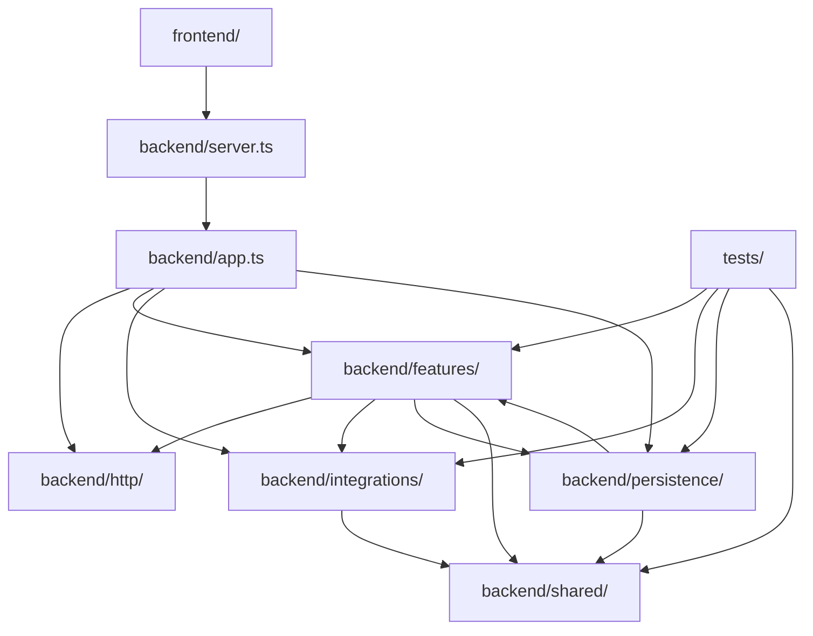
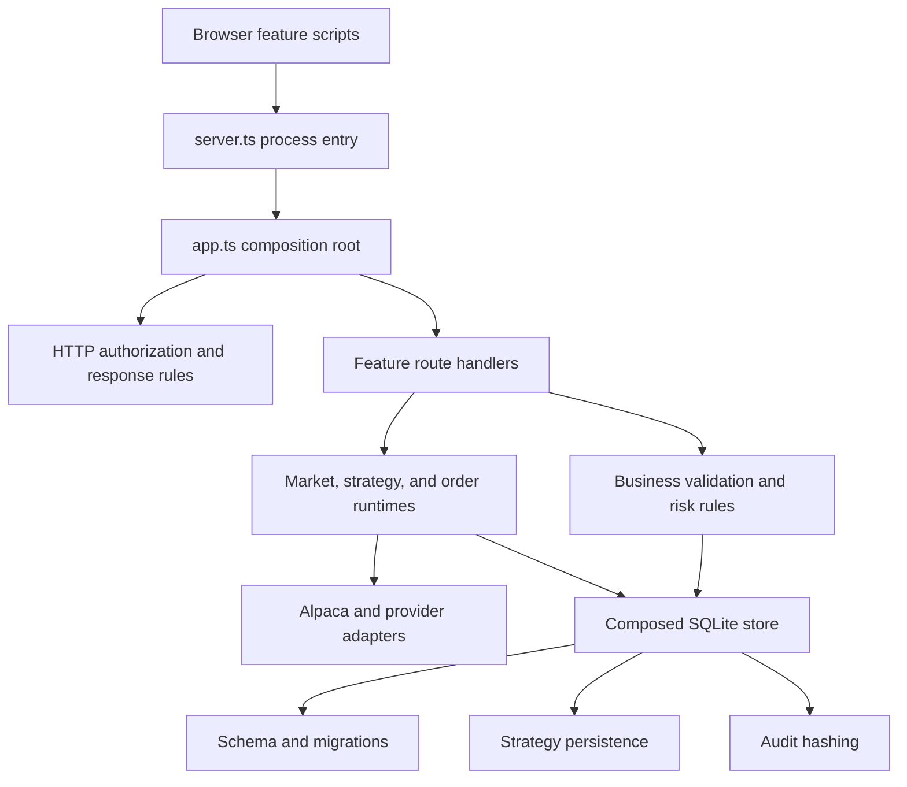

# Architecture

AI Broker is a Bun application with a browser frontend, a paper-trading backend, and SQLite persistence. Live trading is intentionally unavailable.

## Project boundaries

```text
frontend/                 Browser HTML, CSS, and JavaScript
backend/server.ts         Process entry and HTTP server startup
backend/app.ts            Dependency-injected application composition
backend/http/             Shared request, response, and authorization rules
backend/features/         Business rules grouped by product capability
backend/integrations/     Alpaca and external data-provider adapters
backend/persistence/      SQLite schema and storage operations
backend/shared/           Code used by multiple backend boundaries
tests/                    Tests grouped to mirror backend boundaries
scripts/                  Diagnostics, smoke checks, and evaluations
docs/                     Product and operating documentation
```

## Dependency direction



`server.ts` owns process startup; `app.ts` owns application wiring. `backend/http/` owns transport-wide policy. Feature route modules translate HTTP requests into feature calls; the remaining feature modules own calculations, validation, and policy. Integrations translate external provider data. Persistence owns durable state and imports feature types only where the stored contract requires them.

## Chosen system model

AI Broker is a **modular monolith with ports-and-adapters boundaries**. This is the right fit for a personal broker: one deployable process keeps order validation, risk reservation, persistence, and audit writes close enough to reason about atomically, while feature and integration boundaries prevent the codebase from becoming another flat monolith.

Microservices would add network failure modes and distributed transactions without helping a single-account workload. Split deployment units only when independently measured scaling, isolation, or availability requirements justify them.

The execution path must preserve this order:


No route extraction may reorder or bypass that pipeline.

## Change rules

- Put code in the feature that owns the behavior. Move it to `shared/` only after a second independent consumer exists.
- Keep provider-specific payload handling in `integrations/`; expose normalized values to features.
- Comment safety constraints, provider quirks, and non-obvious decisions. Do not comment syntax that already explains itself.
- Keep tests in the matching `tests/` boundary and run `bun run check` before merging.
- Preserve paper-only execution, signed previews, fresh-state validation, and operational policy checks when moving order code.

## Current state

`backend/server.ts` creates production dependencies and owns process startup. The side-effect-free `backend/app.ts` composes routes and runtimes. Operations, research/advisor, portfolio, market, strategy, and order behavior live in their feature folders.



The market boundary keeps provider retrieval and presentation separate:

- `markets/service.ts` owns provider calls, cache lifetimes, and response-time
  capture for market routes.
- `markets/market-workspace.ts` owns pure watchlist, discovery, calendar, and
  workspace normalization. Watchlist detail retrieval completes before its
  retrieval timestamp is captured; the workspace root aggregates child times
  without relabeling retrieval as observation.

The order boundary is deliberately split by responsibility:

- `orders/runtime.ts` owns broker recovery, stream reconciliation, pending-order valuation, and broker submission helpers.
- `orders/routes.ts` composes order handlers and owns order management, receipts, and decision-audit HTTP translation.
- `orders/equity-routes.ts` owns signed equity previews and fresh-state submissions.
- `orders/basket-routes.ts` owns basket previews, reservations, and independent leg submissions.
- `orders/options-routes.ts` owns option discovery, position actions, and option order workflows.

These modules share one runtime and preserve the safety pipeline above.

`portfolio/account-state.ts` owns the allow-listed account/position composite
returned to the browser. It applies the shared time taxonomy to account,
position, and managed-order state without treating request receipt time as a
provider observation. The order runtime retains per-order REST/stream receipt
times so route normalization can preserve the provenance of the state that
actually won reconciliation.

The strategy boundary is split by responsibility the same way:

- `strategies/runtime.ts` owns strategy evaluation, paper-order and risk decisions, evidence writes, and scheduler polling.
- `strategies/routes.ts` guards the `/api/strategy/` prefix and composes the strategy route handlers in pipeline order.
- `strategies/strategy-execution-routes.ts` owns crypto market-data ingest and the signed-preview paper-execution pipeline.
- `strategies/strategy-dataset-routes.ts` owns bounded long-history crypto-bar ingestion and actor-scoped immutable dataset retrieval.
- `strategies/strategy-datasets.ts` owns chunk planning, normalization, quality evidence, correction comparison, and deterministic dataset hashing.
- `strategies/strategy-walk-forward.ts` owns bounded train-only candidate selection, frozen test scoring, fold aggregation, and leakage evidence.
- `strategies/strategy-lifecycle-routes.ts` owns backtests, strategy-run creation, scheduler ticks, and admin mutations (approval, pause, kill, review).
- `strategies/strategy-reporting-routes.ts` owns read-only run reporting, evidence, and single-run manual ticks.
- `strategies/strategy-runtime-provenance.ts` owns pure symbol, definition, config-hash, provenance, and audit-snapshot helpers.
- `strategies/strategy-runtime-reporting.ts` owns order reconciliation, attribution, performance, and alert reporting.

These modules share one strategy runtime and route context and preserve the safety pipeline above.

Persistence is composed behind the `createStore()` API:

- `persistence/migrations.ts` owns ordered transactional schema changes.
- `persistence/strategy-store.ts` owns strategy datasets, evidence, and audit persistence.
- `persistence/audit.ts` owns deterministic audit hashing.
- `persistence/store.ts` composes those pieces with order, portfolio, research, and operations storage.

The browser uses ordered, dependency-free scripts instead of a build step. `core.js` provides shared UI behavior; `portfolio.js`, `strategies.js`, `market-detail.js`, and `research.js` own their workspaces; `app.js` starts initial loads and refresh timers.
